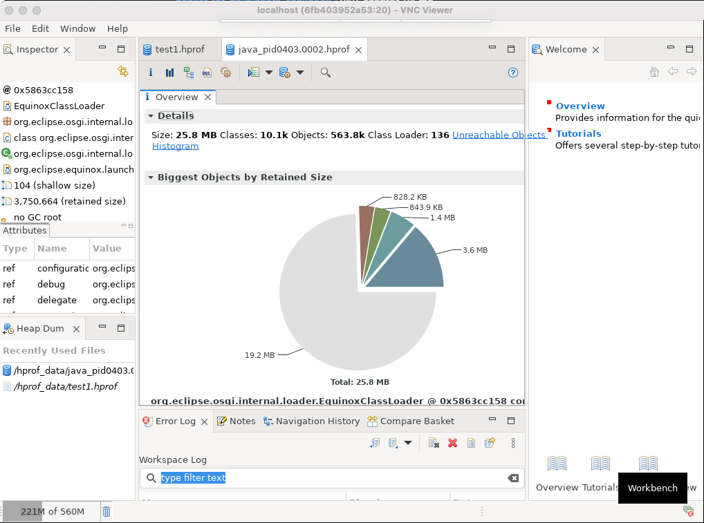

### Chapter 5 - Debugging Tools

## Introduction

Most of the time containers are used for background services that listen on a port. What if you want to run a GUI (graphical user interface) app? There are a few techniques that can be used to run these apps. One of them involves setting up a remote server using [VNC](https://en.wikipedia.org/wiki/Virtual_Network_Computing) to listen on the container's port. Then, using a VNC client on the host, you can view visually interact with the application. Using the [x11vnc library](https://github.com/LibVNC/x11vnc) in Linux we can set up and run a Docker container to act as the server and use a [VNC client](https://www.realvnc.com/en/connect/download/viewer) to log in and interact with our GUI apps.

### Eclipse Memory Analyzer

The Eclipse Memory Analyzer app is a Java application that can be used to analyze Java memory dump files. There's a similar tool, `jhat`, which comes preinstalled with most Java installations but is web based and has fewer features than the Memory Analyzer app. The Memory Analyzer app is a graphical app with lots of features and visualizations. Even though this app has specific requirements which could make it difficult to install and run on your operating system, Docker makes it easy to get this app running on any system.



First, create a directory for the app and move into that directory.

```bash
mkdir ~/mat-docker
cd ~/mat-docker
```

Second, add a `Dockerfile`.

```bash
touch Dockerfile
```

Third, copy the following lines into your `Dockerfile` using your favorite text editor.

```bash
# Dockerfile
FROM openjdk:23-jdk-slim-bullseye
RUN apt update && apt install -y x11vnc xvfb unzip libswt-gtk-4-jni
ENV MAT_FILENAME=MemoryAnalyzer-1.15.0.20231206-linux.gtk.x86_64.zip
ENV XMX_OPTS="10g" # will be overriden in the docker-compose.yml file
ADD $MAT_FILENAME .
RUN unzip $MAT_FILENAME
RUN sed -i -e 's/Xmx1024m/Xmx'"$XMX_OPTS"'/g' ./mat/MemoryAnalyzer.ini
RUN echo "exec ./mat/MemoryAnalyzer" > ~/.xinitrc && chmod +x ~/.xinitrc
CMD ["/usr/bin/x11vnc", "-create", "-forever", "-clip", "1030x740+0+0"]
```

Fourth, download a copy of the Linux version of the Memory Analyzer app to the directory you created above from https://eclipse.dev/mat/downloads.php. The version you download depends on your computer's hardware. Select `x86_64` for an Intel processor or `aarch64` for an ARM processor and modify the `MAT_FILENAME` environment line to match in the Dockerfile above. You can leave the file in it's zipped form because there's a command in the Dockerfile that will unzip the contents of the archive to a directory in the Docker image.

Fifth, add a `docker-compose.yml` file to the same directory and copy the contents below into this file. The `XMX_OPTS` environment variable will set the memory limits of the Memory Analyzer app and will override the value in the `Dockerfile` above when the container starts. Larger hprof files may require adjustments to this value. You may also need to adjust the amount of memory allowed in your Docker environment, usually found under Docker Desktop Settings/Resources.

```yaml
# docker-compose.yml
# usage: docker-compose up

version: "3"
services:
  gui:
    environment:
      XMX_OPTS: 15g
    build:
      dockerfile: Dockerfile
    ports:
    - "0.0.0.0:5900:5900"
    volumes:
    - ./:/hprof_data
```

Sixth, copy your `.hprof` file to the directory created in step 1 above to make it accessible to the app running in the container.

Seventh, run `docker-compose up` to build and run the container.

Lastly, using your VNC client, connect to `localhost`. The client should default to port `5900` which is defined in the `docker-compose.yml` file above. After a few seconds you should see a window with the Memory Analyzer app running in the Docker environment. From here, you can interact with the graphical interface and open the `.hprof` file by clicking `File/Open Heap Dump...` and navigating to the `/hprof_data` directory.

## Resources

* https://eclipse.dev/mat/
* https://en.wikipedia.org/wiki/Virtual_Network_Computing
* https://github.com/LibVNC/x11vnc
* https://www.howtogeek.com/devops/how-to-run-gui-applications-in-a-docker-container/
* https://www.realvnc.com/en/connect/download/viewer

[Next >>](060-chapter-06.md)
