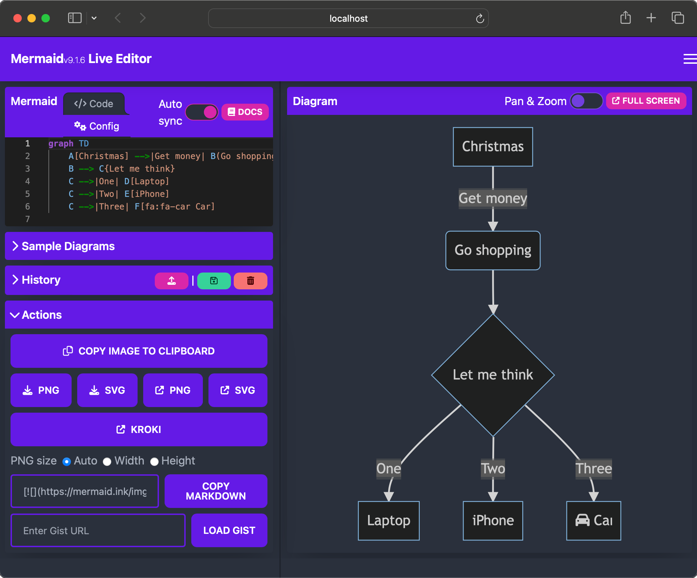

### Chapter 6 - Diagrams

## Introduction

There have long been command line tools and websites available that developers can use to generate diagrams, but what if you want to keep your personal or company documentation private and out of the cloud? Docker allows us to run these tools locally and keep our documentation on our development machines.

### Mermaid

[Mermaid](https://mermaid.js.org) is a diagramming tool which makes it easy to generate flow charts and other diagrams from text-based definitions.



Run the following docker command to download the image and start the container.

```bash
docker run --rm --name mermaid-live-editor --publish 8080:80 johnsinclair73/mermaid-live-editor:9.1.7
```

Next, open a browser and go to http://localhost:8080/edit where you'll see a live editor that will auto refresh the diagram as you edit the definition in the editor.

## Resources

* https://hub.docker.com/r/johnsinclair73/mermaid-live-editor

[Next >>](070-chapter-07.md)
