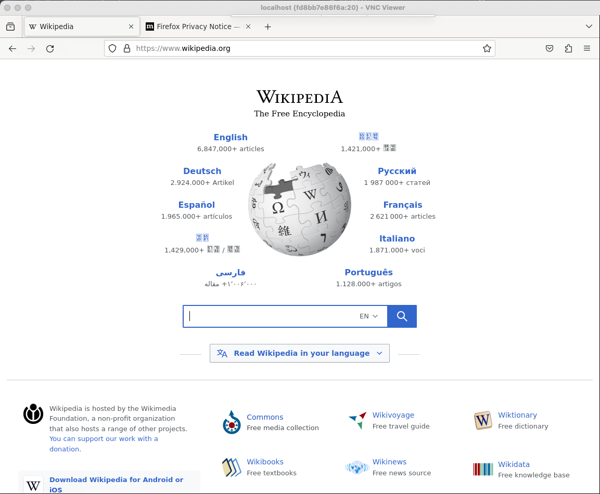

### Chapter 9 - Browsers

## Introduction

Ever wished you could quickly check a website in a different browser without installing that browser? Docker makes it simple. Just create two files, build, run and test away.

### Firefox

Firefox is a web browser that runs on many operating systems. We can use Docker to run a version of Firefox for one operating system on a completely different operating system, for example: testing a website in an Ubuntu (Linux) installation of Firefox on macOS.



To run the Linux based version of Firefox on Windows or macOS: first, create a directory and add a `Dockerfile` and switch to that directory.

```bash
mkdir ~/firefox-docker
cd ~/firefox-docker
```

Second, copy the following lines into your `Dockerfile` and save the file.

```bash
# Dockerfile
FROM ubuntu:latest
RUN apt update && apt install -y x11vnc xvfb firefox
RUN echo "exec firefox" > ~/.xinitrc && chmod +x ~/.xinitrc
CMD ["/usr/bin/x11vnc", "-create", "-forever"]
```

Third, add a `docker-compose.yml` file to the same directory and copy the contents below into this file.

```yaml
# docker-compose.yml
# usage: docker-compose up

version: "3"
services:
  gui:
    build:
      dockerfile: Dockerfile
    ports:
    - "0.0.0.0:5900:5900"
```

Now run `docker-compose up` to build and run the container.

The last step is to download and run a VNC client. After installing, connect to `localhost` (the default port of 5900 can be used). You should now see a window with the Firefox app running in the Docker environment.

## Resources

* https://www.mozilla.org/en-US/firefox/
* https://www.realvnc.com/en/connect/download/viewer

[Next >>](100-chapter-10.md)
