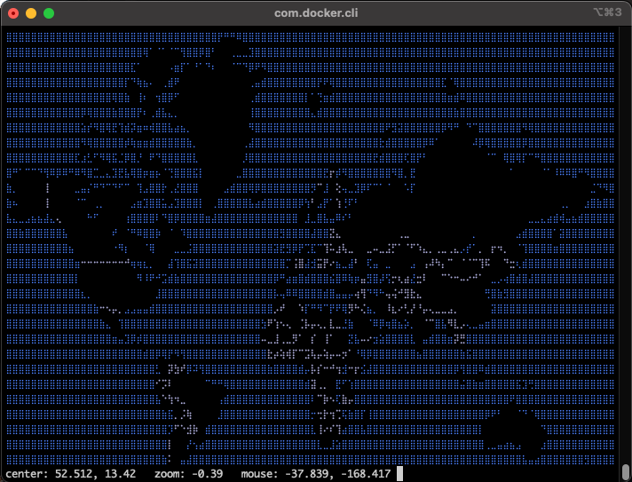

### Chapter 10 - Miscellaneous

## Introduction

Besides using Docker for tools, background services and games, there are a variety of other apps available.

### Ascii Maps

This app draws a map of the world using ascii characters. Use your mouse or the following keyboard shortcuts to move and zoom in and out. It's impressive the amount of data that's in this app. I've been able to zoom down to the city and street where I live.



|Key|Mouse|Description|
|---|---|---|
|Up|Click and drag|Go up|
|Down|Click and drag|Go down|
|Left|Click and drag|Go left|
|Right|Click and drag|Go right|
|a|Scroll up|Zoom in|
|z|Scroll down|Zoom out|
|esc||Exit|

To download and run this app, run the docker command below.

```
docker run -it pdevine/mapscii
```

## Resources

* https://hub.docker.com/r/pdevine/mapscii

[Next >>](110-chapter-11.md)
